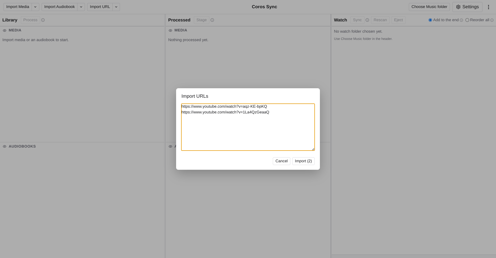
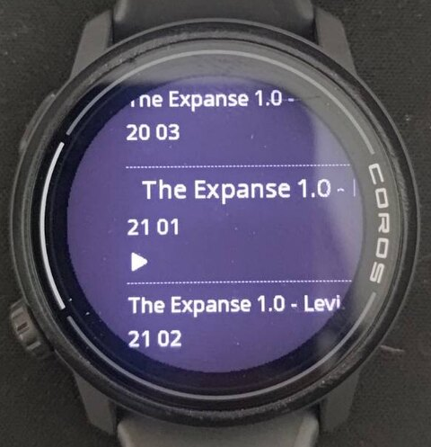
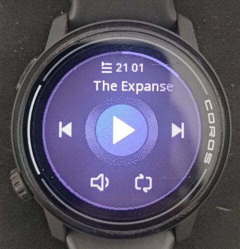
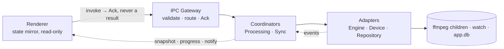

# Coros Sync App

Import local music and audiobooks, transcode them to mp3, optionally split the long
ones into parts, and sync them onto a Coros watch over USB. Built against a Pace 3;
other models may (not) work, tell me and i can add a table with support.

_An independent project. Not affiliated with, endorsed by or supported by COROS_


[Why it exists](#why-it-exists) · [Install](#install) · [Instructions](#instructions) · [Settings](#settings) · [On the watch](#on-the-watch) · [Architecture](#architecture) · [Development](#development) · [Support the tools](#support-the-tools-underneath)

## Support the tools underneath

Every probe and every transcode in this app is [FFmpeg](https://ffmpeg.org), and
[yt-dlp](https://github.com/yt-dlp/yt-dlp) is what fills the library it syncs. Both are
free software and both run on donations.

FFmpeg runs most of the video on the internet. Google
puts YouTube through it, Netflix, Meta and Amazon transcode with it, Microsoft ships it
in Azure's media pipeline, Chrome and Firefox decode with its libraries, and VLC is
built on them. A handful of largely unpaid maintainers keep all of that working.

<p>
  <a href="https://ffmpeg.org/donations.html">
    
  </a>
  &nbsp;&nbsp;&nbsp;&nbsp;
  <a href="https://github.com/yt-dlp/yt-dlp/blob/master/Maintainers.md">
    
  </a>
</p>

- **Donate to FFmpeg** → [ffmpeg.org/donations.html](https://ffmpeg.org/donations.html)
- **Donate to yt-dlp** → [its maintainers' sponsor links](https://github.com/yt-dlp/yt-dlp/blob/master/Maintainers.md)

## Why it exists

I listen to mainly audiobooks or long YouTube videos when I run, and created a few
scripts to download, convert, split, rename and sync by order the resulting files.
Decided to turn that process into an application so it could be shared.

Everything runs locally. The only network call is yt-dlp fetching a YouTube URL you
paste in.

Work in progress. Issues and suggestions welcome.

### Install

Downloads are on the [Releases](../../releases) page. Nothing else to install — FFmpeg and
yt-dlp ship inside. Plug the watch in as USB storage before you start.

| Platform    | File                                                             | First launch                                                                                            |
| ----------- | ---------------------------------------------------------------- | ------------------------------------------------------------------------------------------------------- |
| macOS 12+   | the `darwin-arm64` zip for Apple silicon, `darwin-x64` for Intel | Unzip, drag to Applications. macOS refuses it — **System Settings → Privacy & Security → Open Anyway**. |
| Windows 10+ | the `Setup.exe`                                                  | SmartScreen warns — **More info → Run anyway**.                                                         |
| Linux       | the `.deb` or `.rpm`                                             | `sudo apt install ./<file>.deb`, or `sudo dnf install ./<file>.rpm`                                     |

Both warnings say the same thing: the macOS build is signed ad-hoc and the Windows one is
not signed at all.

### Instructions

**1 · Point it at the watch.** Plug it in as USB storage, press **Choose Music
folder**, and pick the `Music` folder inside the volume — not the volume. The **Watch**
column then mirrors the device, rescanning on focus, on **Rescan**, and before every
sync. **Eject** unmounts.

**2 · Import.** **Import Media** for music and podcasts: one file in, one mp3 out.
**Import Audiobook** cuts at chapter marks, splitting any chapter longer than the split
length. The arrow beside either takes a whole folder. **Import URL** hands a YouTube
link to yt-dlp: the audio lands in **Library** as a _source_, and **Process** still
makes the mp3. If URL imports start failing, YouTube has changed — **Update yt-dlp** in
Settings. Titles can be renamed or deleted until processed.



**3 · Process.** Tick rows, press **Process**. Bitrate and split length are read at that
moment, so set them first. Rows show a spinner, a part counter, and an `×` to cancel.


**4 · Stage.** Tick finished items in **Processed** and press **Stage**. They appear
below the divider in the Watch column, numbered in playback order — drag to reorder, `⇤`
to take one back.

**5 · Sync.** **Add to the end** appends the staged list. **Reorder all** deletes and
rewrites every file the app manages in your order, since the watch cannot reorder in
place; it tells you the cost first. Files it did not put there survive as _unmanaged_,
unplaceable.

Files copy one at a time. **Stop** lands between files, never mid-file, and unplugging
mid-transfer is not fatal — a rescan corrects the record.

### Settings


Seed settings are read when you press **Process** and recorded on the item; changing one
never rewrites what is already processed. Live settings are read as they are used.

| Setting                        | Kind | Meaning                                                                            | Default   |
| ------------------------------ | ---- | ---------------------------------------------------------------------------------- | --------- |
| Media bitrate                  | Seed | kbps for music and podcasts                                                        | 128       |
| Audiobook bitrate              | Seed | kbps for books — speech needs less than music                                      | 64        |
| Split every                    | Seed | chapters longer than this become multiple parts                                    | 10 min    |
| Concurrency                    | Live | how many FFmpeg children may run at once                                           | cores − 1 |
| Log level                      | Live | the log records only failures, sweeps and startup reconciliation                   | `info`    |
| Rename audiobooks on the watch | Live | write the composed name instead of the original; applies to the next _Reorder all_ | on        |
| Rename media on the watch      | Live | same, for music and podcasts                                                       | off       |
| yt-dlp binary                  | Live | path to a yt-dlp of your own; blank uses the bundled one                           | —         |
| Update yt-dlp                  | —    | fetches a current yt-dlp and points the field above at it                          | —         |
| Watch Music folder             | Live | the mount path — picked, not detected                                              | —         |

The `⋮` menu opens the log folder, copies the logs, and opens the app-data folder.

### On the watch

The watch shows **ID3 tags, not filenames** — title on the big line, artist on the small
one, which is what the rename settings are for. An audiobook gets the book as title and
`CC PP` — chapter, then part — as artist, so its parts read as one book in order. Music
and podcasts get the filename stem and the item's author.

<p>
  
  &nbsp;
  
</p>

The file on disk is named separately — `<title> - CC - <chapter> - PP.mp3`, stripped of
what FAT rejects and cut to 120 characters. Nothing reads it back: the name finds the
file, the tags fill the screen, and neither decides playback order. Write order does.

### Architecture

Three layers in main, dependencies pointing one way: edge → domain → infrastructure. The
renderer is sandboxed — it sends intents and mirrors the event stream, never writing its
own state.



The rules that hold it together:

- An output row is written only after FFmpeg exits 0 and the file provably exists.
- There is no `failed` state: failure cleans up the item's outputs and reverts it.
- Every device write is `.part` then an atomic rename — the rename is the confirmation,
  not the last byte.
- The device is polled on demand and the scan discarded; all it leaves behind is a
  corrected `onWatch` boolean.
- Transfers are serial and written forward, because write order is playback order.

The design is binding: [CONTRACTS.md](docs/CONTRACTS.md) for every seam's shape,
[DECISIONS.md](docs/DECISIONS.md) for the log and what breaks if you reverse one,
[ARCHITECTURE.md](docs/ARCHITECTURE.md) for how it works — decisions beat contracts,
contracts beat prose, prose beats code.

### Development

```bash
npm install
# Drop STATIC ffmpeg + ffprobe builds (with libmp3lame) for your platform/arch
# into resources/bin/ — it is gitignored and starts empty.
npm run verify:bin   # confirms they are static and round-trip a sine to mp3
npm start
```

| Command                    | Does                                                        |
| -------------------------- | ----------------------------------------------------------- |
| `npm start`                | Run in dev via Electron Forge                               |
| `npm run package` / `make` | Build the app / distributables                              |
| `npm run lint`             | ESLint over the TypeScript                                  |
| `npm run test:e2e`         | Repackage, then run Playwright against the **packaged** app |

No unit tests, by design — the specs in [e2e/](e2e/) drive the real packaged binary, with
the native dialogs stubbed in the harness so nothing in `src/` knows a test exists.

### License

[GNU GPL v3.0 or later](LICENSE) © 2026 Ricardo Reis. Anything built on this stays
open source.

The bundled FFmpeg and LAME are LGPL-2.1-or-later and are run as separate processes, never
linked in. Their licence texts, the exact configure line and a pointer to the matching source
ship inside the app, in `resources/bin/THIRD-PARTY.txt`.
