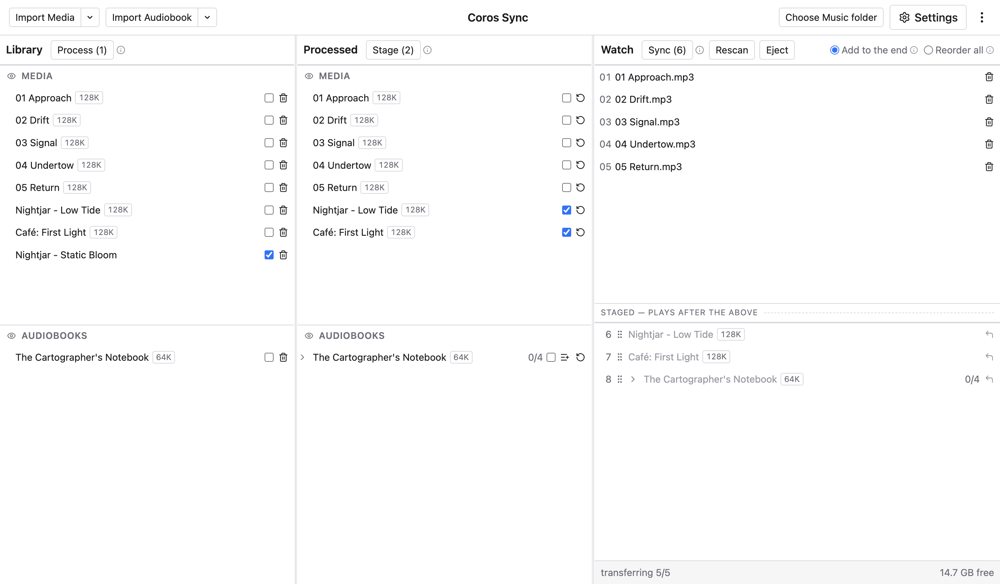
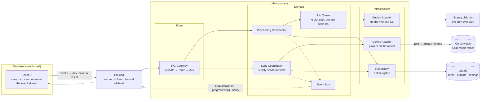
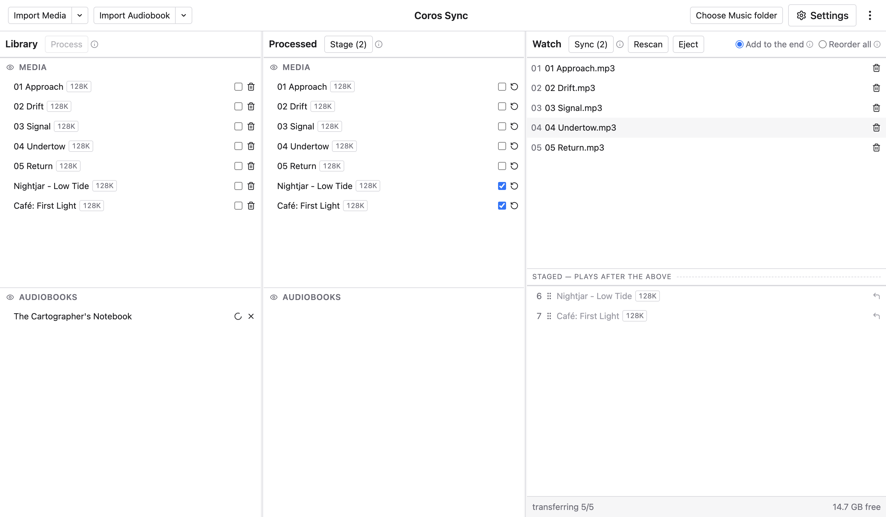
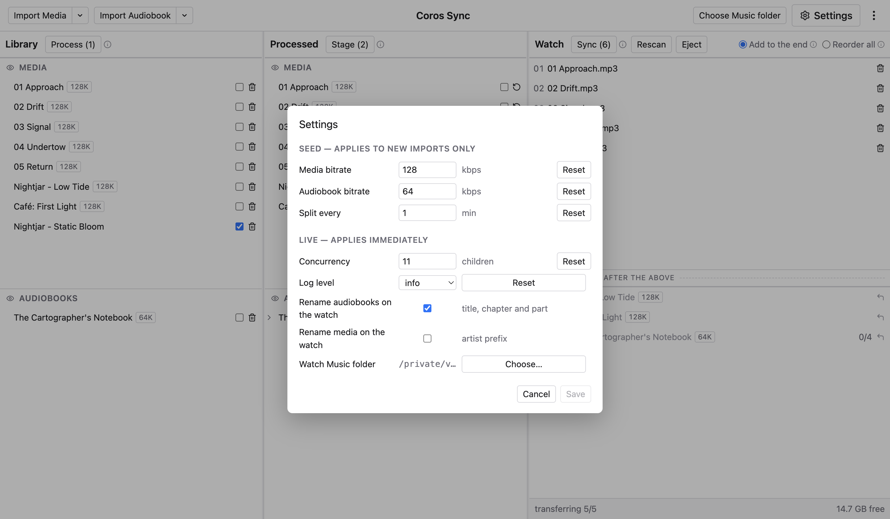

# Coros Sync

Import local music and audiobooks, transcode them to mp3 with a bundled FFmpeg, and
sync them onto a Coros watch over USB — in the order you want them played.



Everything is local. Zero network requests in any code path — no updater, no
telemetry. The app itself never touches your audio bytes: FFmpeg reads the sources
and writes the mp3s; the app passes paths, watches exit codes, and only records a
file once it provably exists.

## Architecture

Three layers in the main process, dependencies pointing one way (edge → domain →
infrastructure), with a sandboxed renderer that can only `invoke` intents and mirror
the event stream back. State on screen is never optimistic — the mirror has one
writer, and that writer is reality.



A few load-bearing choices, in one breath: rows follow reality (an output row is
written after ffmpeg exits 0, never in anticipation); there is no `failed` state
(failure cleans up and reverts); every device write is `<name>.part` then an atomic
rename, and the rename — not the last byte — is the confirmation; the device is
polled on demand and the scan is discarded, correcting only the `onWatch` boolean;
transfers are serial and written forward, because playback order *is* write order.
The full reasoning lives in [docs/ARCHITECTURE.md](docs/ARCHITECTURE.md), and the
shape of every seam in [docs/CONTRACTS.md](docs/CONTRACTS.md).

## Using it

### 1. Point it at the watch

Plug the watch in as USB storage and press **Choose Music folder** in the header —
pick the `Music` folder *inside* the watch's volume, not the volume itself. The
**Watch** column then shows what is on the device; it rescans on window focus, on
**Rescan**, and before every sync. **Eject** unmounts the volume when you're done.

### 2. Import

**Import Media** for music — each file becomes one mp3. **Import Audiobook** for
books — cut at chapter marks, and any chapter longer than the split length becomes
several parts. The arrow beside either button imports a whole folder. Everything
lands in **Library**, where a title can be renamed until it is processed, or deleted
with the trash icon.

### 3. Process

Tick rows and press **Process**. Each file gets its own ffmpeg child from a pool of
`N` (the Concurrency setting); a processing row shows a spinner, a part counter for
audiobooks, and an `×` to cancel. Bitrates and split length are read *at this
moment* — change them in Settings first — and the bitrate an item was made with is
then badged beside its title forever.



### 4. Stage

Finished items appear in **Processed**. Tick what should go to the watch and press
**Stage** — that builds the send list, drawn below the divider in the Watch column,
numbered in playback order. Drag rows to reorder, or `⇤` to take one back off the
list. Grey means not on the watch yet — and not promised.

### 5. Sync

Two modes, chosen next to the Sync button:

- **Add to the end** — copies the staged list after everything already on the
  watch. The divider is the line it cannot cross.
- **Reorder all** — the watch cannot be reordered in place, so every file this app
  manages is deleted and the list below the line is written back in its order. You
  are told the cost and asked first. Files the app didn't put there survive (marked
  *unmanaged*) — they just can't be placed.

Files copy one at a time, each as a `.part` renamed into place only when complete;
a row's grey turns into a tick as each rename is confirmed. **Stop** lands between
files, never mid-file. Unplugging mid-transfer is normal, not fatal: what landed
stays landed, leftover `.part` files are swept on the next scan, and a rescan sets
the record straight.

### Settings



| Setting | Kind | Meaning |
| --- | --- | --- |
| Media / Audiobook bitrate | Seed | Copied onto an item at import, applied at Process — existing items keep theirs |
| Split every | Seed | Chapters longer than this become multiple parts |
| Concurrency | Live | How many ffmpeg children may run at once (default: cores − 1) |
| Log level | Live | The log records only what the model deliberately forgets — failures, sweeps, reconciliation |
| Rename on the watch | Live | Applied on the next *Reorder all*; files already on the watch keep their name |

The `⋮` menu holds the diagnostics: open the log folder, copy the logs, open the
app-data folder.

## Development

```bash
npm install
# Drop STATIC ffmpeg + ffprobe builds (with libmp3lame) for your platform/arch
# into resources/bin/ — it is gitignored and starts empty.
npm run verify:bin   # confirms the binaries are static and round-trip a sine to mp3
npm start
```

| Command | Does |
| --- | --- |
| `npm start` | Run in dev via Electron Forge |
| `npm run package` / `make` | Build the app / distributables |
| `npm run lint` | ESLint over the TypeScript |
| `npm run test:e2e` | Repackage, then run the Playwright suite against the **packaged** app |

There are no unit tests by design — the 20 e2e specs in [e2e/](e2e/) drive the real
packaged binary end to end, native dialogs stubbed from inside the harness so
nothing in `src/` knows a test exists.

The design itself is documented and binding, in three files:
[docs/CONTRACTS.md](docs/CONTRACTS.md) for the shape of every seam,
[docs/DECISIONS.md](docs/DECISIONS.md) for the decision log and what breaks if you
reverse one, and [docs/ARCHITECTURE.md](docs/ARCHITECTURE.md) for how the program
works. Decisions win over contracts, contracts over prose, prose over code.

**Status** — the full import → process → stage → sync path works and is under e2e
test. Still open: confirming on hardware that the watch plays in directory order,
and macOS signing/notarisation for distribution.

## Support the tools underneath

Every probe and every transcode in this app is [FFmpeg](https://ffmpeg.org);
[yt-dlp](https://github.com/yt-dlp/yt-dlp) is the natural companion for filling the
library it syncs. Both are free software that run on donations — if this app is
useful to you, they are who to thank.

<p>
  <a href="https://ffmpeg.org/donations.html">
    
  </a>
  &nbsp;&nbsp;&nbsp;&nbsp;
  <a href="https://github.com/yt-dlp/yt-dlp/blob/master/Maintainers.md">
    
  </a>
</p>

- **Donate to FFmpeg** → [ffmpeg.org/donations.html](https://ffmpeg.org/donations.html)
- **Donate to yt-dlp** → [its maintainers' sponsor links](https://github.com/yt-dlp/yt-dlp/blob/master/Maintainers.md) (the project's official funding channel)

## License

MIT © Ricardo Reis
