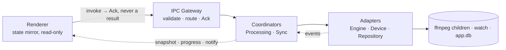

# Coros Sync App

Import local music and audiobooks, transcode them to mp3, optionally split the long
ones into parts, and sync them onto a Coros watch over USB. Built against a Pace 3;
other models may (not) work, tell me and i can add a table with support.


## Story

I listen to audiobooks, podcasts and long YouTube videos when I run, and I had a few
scripts lying around to download, convert and transfer them. I also added a way to
split long files into parts, because the watch gives you no way to seek to a spot
inside a track.

The watch does not play files in the order you upload them either. It orders them by
the timestamp on each file's directory entry. The scripts worked around all of this.

Eventually it seemed worth turning them into an app.

Everything runs locally. The only network call is yt-dlp fetching a YouTube URL you
paste in.

Work in progress. Issues and suggestions welcome.

## Instructions

**1 · Point it at the watch.** Plug the watch in as USB storage and press **Choose
Music folder**. Pick the `Music` folder inside the watch's volume, not the volume
itself. The **Watch** column then shows what is on the device, rescanning on focus, on
**Rescan**, and before every sync. **Eject** unmounts the volume.

**2 · Import.** **Import Media** for music and podcasts — one file in, one mp3 out.
**Import Audiobook** for books — cut at chapter marks, with any chapter longer than the
split length becoming several parts. The arrow beside either button imports a whole
folder. **Import URL** takes a YouTube link — yt-dlp fetches the audio as a *source*,
so it lands in the library like any other import and **Process** still makes the mp3.
If a URL import starts failing, YouTube has changed and the bundled yt-dlp has gone
stale: **Update yt-dlp** in Settings fetches a current one.
Everything lands in **Library**, where a title can be renamed or deleted until it is
processed.


**3 · Process.** Tick rows and press **Process**. Bitrate and split length are read at
that moment, so change them in Settings first. A processing row shows a spinner, a part
counter for audiobooks, and an `×` to cancel.


**4 · Stage.** Finished items appear in **Processed**. Tick them and press **Stage** to
build the send list, drawn below the divider in the Watch column and numbered in
playback order. Drag rows to reorder, or press `⇤` to take one back off.

**5 · Sync.** Two modes, chosen next to the Sync button:

- **Add to the end** — copies the staged list after everything already on the watch.
- **Reorder all** — the watch cannot be reordered in place, so every file this app
  manages is deleted and rewritten in your order. You are told the cost and asked
  first. Files the app did not put there survive as _unmanaged_, but cannot be placed.

Files are copied one at a time. **Stop** takes effect between files, never mid-file,
and unplugging mid-transfer is not fatal — a rescan corrects the record.

## Settings


Seed settings are read when you press **Process** and then recorded on the item.
Changing one never rewrites something already processed. Live settings are read at the
moment they are used.

| Setting                        | Kind | Meaning                                                                            | Default   |
| ------------------------------ | ---- | ---------------------------------------------------------------------------------- | --------- |
| Media bitrate                  | Seed | kbps for music and podcasts                                                        | 128       |
| Audiobook bitrate              | Seed | kbps for books — speech needs less than music                                      | 64        |
| Split every                    | Seed | chapters longer than this become multiple parts                                    | 10 min    |
| Concurrency                    | Live | how many FFmpeg children may run at once                                           | cores − 1 |
| Log level                      | Live | the log records only failures, sweeps and startup reconciliation                   | `info`    |
| Rename audiobooks on the watch | Live | write the composed name instead of the original; applies to the next _Reorder all_ | on        |
| Rename media on the watch      | Live | same, for music and podcasts                                                       | off       |
| yt-dlp binary                  | Live | path to a yt-dlp of your own; blank uses the bundled one                           | —         |
| Update yt-dlp                  | —    | fetches a current yt-dlp and points the field above at it                          | —         |
| Watch Music folder             | Live | the mount path — picked, not detected                                              | —         |

The `⋮` menu holds the diagnostics: open the log folder, copy the logs, and open the
app-data folder.

## On the watch

The watch shows **ID3 tags, not filenames** — the title on the big line, the artist on
the small line under it. That is what the rename settings are for.

For an audiobook the app puts the book on the title line and `CC PP` — chapter, then
part — on the artist line, so a list of parts reads as one book in order:


Music and podcasts get the filename stem as the title and the item's author as the
artist.

The file on disk is named separately, as `<title> - CC - <chapter> - PP.mp3`, stripped
of characters FAT rejects and cut to 120 characters. Nothing ever reads it back — the
name is for finding the file on the volume, the tags are for the screen, and neither
one decides playback order. That comes from write order alone.

## Architecture

The main process has three layers, with dependencies pointing one way: edge → domain →
infrastructure. The renderer is sandboxed: it sends intents and mirrors the event
stream. It never updates its own state, because incoming events are the only writer.



The rules that hold it together:

- An output row is written only after FFmpeg exits 0 and the file provably exists.
- There is no `failed` state. Failure cleans up the item's outputs and reverts it.
- Every device write is `.part` then an atomic rename. The rename is the confirmation,
  not the last byte.
- The device is polled on demand, and the scan is then discarded. All it leaves behind
  is a corrected `onWatch` boolean.
- Transfers are serial and written forward, because write order is playback order.

The design is documented and binding, in three files:
[CONTRACTS.md](docs/CONTRACTS.md) for the shape of every seam,
[DECISIONS.md](docs/DECISIONS.md) for the decision log and what breaks if you reverse
one, and [ARCHITECTURE.md](docs/ARCHITECTURE.md) for how the program works. Decisions
win over contracts, contracts over prose, and prose over code.

## Development

```bash
npm install
# Drop STATIC ffmpeg + ffprobe builds (with libmp3lame) for your platform/arch
# into resources/bin/ — it is gitignored and starts empty.
npm run verify:bin   # confirms they are static and round-trip a sine to mp3
npm start
```

| Command                    | Does                                                        |
| -------------------------- | ----------------------------------------------------------- |
| `npm start`                | Run in dev via Electron Forge                               |
| `npm run package` / `make` | Build the app / distributables                              |
| `npm run lint`             | ESLint over the TypeScript                                  |
| `npm run test:e2e`         | Repackage, then run Playwright against the **packaged** app |

There are no unit tests, by design. The specs in [e2e/](e2e/) drive the real packaged
binary end to end, with the native dialogs stubbed inside the harness so that nothing
in `src/` knows a test exists.

**Status.** The import → process → stage → sync path works and is under e2e test, URL
import included (ADR-0027, ADR-0055, ADR-0056). Still open: confirming on hardware that
the watch keeps its order across a power cycle; a playlist link imports only its first
entry; how often a release should move the pinned yt-dlp version, given that a pin goes
stale in about a month and **Update yt-dlp** is the answer in between; and macOS signing
and notarisation.

## Support the tools underneath

Every probe and every transcode in this app is [FFmpeg](https://ffmpeg.org), and
[yt-dlp](https://github.com/yt-dlp/yt-dlp) is what fills the library it syncs. Both are
free software and both run on donations.

<p>
  <a href="https://ffmpeg.org/donations.html">
    
  </a>
  &nbsp;&nbsp;&nbsp;&nbsp;
  <a href="https://github.com/yt-dlp/yt-dlp/blob/master/Maintainers.md">
    
  </a>
</p>

- **Donate to FFmpeg** → [ffmpeg.org/donations.html](https://ffmpeg.org/donations.html)
- **Donate to yt-dlp** → [its maintainers' sponsor links](https://github.com/yt-dlp/yt-dlp/blob/master/Maintainers.md)

## License

[GNU GPL v3.0 or later](LICENSE) © 2026 Ricardo Reis. Anything built on this stays
open source.
