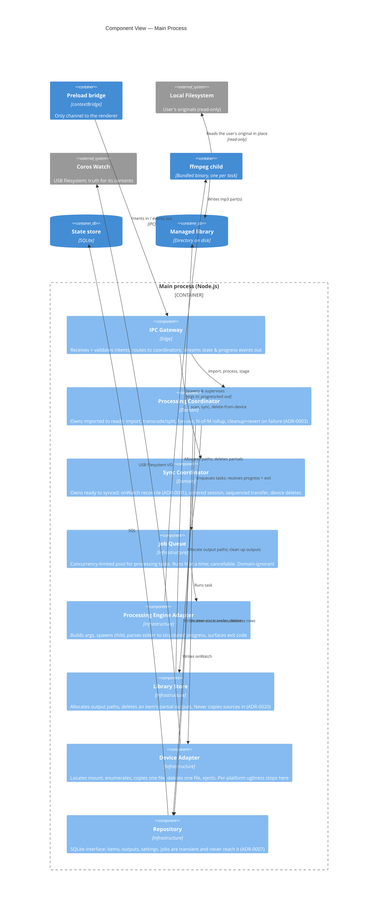

# Architecture — Coros Sync App

How the program works: what it does, what the pieces are, how they depend on each
other, and what happens when something goes wrong.

**This document carries reasoning, never shape.** The schema, the IPC surface, the
adapter signatures and the settings table are `CONTRACTS.md`. The decisions and what
breaks if you reverse one are `DECISIONS.md`. If this file and CONTRACTS disagree
about a seam, CONTRACTS wins; if either disagrees with a decision, the decision wins.

---

## 1. Scope

An Electron desktop app that takes local media files, processes them into mp3s, and
moves those mp3s onto a **Coros watch** over USB. A staged pipeline —
`import → process → stage → sync` — plus a side capability to manage what already
lives on the device.

**In scope.** Import audio as *media* or *audiobook*, file or folder, preserving the
folder grouping. Convert to mp3 at a type-specific bitrate, sources read **in place**
and never mutated (ADR-0020); for audiobooks, split at chapter markers and cut any
chapter longer than the split interval into fixed-length parts, so one source fans out
to many outputs. Rewrite **title and author** tags only, for on-device legibility.
Stage processed items as ready to sync. Transfer them in a **user-controlled
sequence**, in two modes — `Add to the end` (only what is not already there) and
`Reorder all` (delete every managed file and rewrite the list). View what is on the
watch and delete individual tracks from it. Remove an item from the library
(ADR-0022), which touches the library only.

**Out of scope, deliberately.** Audio editing beyond convert / split / two tags. In-app
playback. Cloud, streaming, accounts, or networking of any kind. Devices other than
Coros. Video. Editing the user's originals.

### The three quality drivers

Only the attributes that actually forced a decision:

| Driver | Consequence |
|---|---|
| **Cross-platform** (Windows/macOS/Linux) | No OS-specific assumptions; per-platform bundled binaries; the watch is *located*, never detected. Shapes packaging (§9). |
| **Offline / local-first** | Zero network. The engine is **bundled, not downloaded**. |
| **Reliable transfer & processing** | **Interruption is normal, not exceptional.** Operations must be recoverable and state reconcilable. This drives half of §7. |

*Performance* is excluded on purpose — transcode speed shapes nothing here. *Security*
is handled where it is enforced (§8.4), not as a scope-level driver.

---

## 2. The six facts everything rests on

These fall out of the scope above and drive every later section.

1. **Staged pipeline; items carry state.** `imported → processing → processed →
   ready` — four values, and no fifth: "synced" is derived from `onWatch`, never
   stored (§6.5). The spine of the data model.
2. **The app owns a managed master library of its *outputs*** — the mp3s it produced —
   separate from the user's originals and from the device. Sources are read in place
   and never copied in (ADR-0020).
3. **The device is a queryable USB filesystem and is authoritative for its own
   contents.** `onWatch` is a *cache* — "last known," re-derived by scanning, and moved
   only by a **confirmed** device operation, never a merely intended one.
4. **Upload order = playback order.** Written, corrected away on 08-13, restored on
   08-16 (ADR-0044 superseding ADR-0035), confirmed a third time on 08-18 (ADR-0049).
   The thing that runs backwards was never the player. Both edits are left visible on
   purpose. *Still unverified: whether the player follows write time or directory
   position* — see `DECISIONS.md §4`.
5. **One source can fan out to many outputs.** The model must not assume one input =
   one mp3.
6. **The library and the device contents are two independent stores.** Sync is the
   *relationship between them*, not one mirroring the other. **The guarantee is
   directional** (device → library only): since ADR-0022, deleting from the library
   deliberately leaves a synced file behind on the watch, as an unmanaged one.

### The two neighbours, and how each can fail

One actor, two external systems. The value of the boundary is the failure surface:

| External | App does | Can be |
|---|---|---|
| **Local filesystem (source)** | reads originals; never writes them | file missing/moved, permission denied, a path valid on one OS layout and not another |
| **Coros watch** | enumerates, writes, deletes; authoritative | unplugged mid-operation, full, slow, forbidden by the OS, I/O error — the main reliability concern |

Both the managed library and the processing engine are **internal** — storage and a
binary the app owns, not external stores or user-supplied tools.

---

## 3. Containers

Six runnable-or-stateful pieces: the **renderer** (Chromium/React, sandboxed UI), the
**preload bridge** (the only channel across the boundary), **main** (Node — the
privileged orchestrator), the **ffmpeg child** (spawned per task), the **state store**
(SQLite), and the **managed library** (a directory of produced mp3s).

| Decision | Rationale |
|---|---|
| **Electron, main/renderer split** | One codebase across platforms. The process split *is* the security boundary. |
| **All OS access in main; renderer sandboxed, bridged by preload** | The renderer cannot touch disk or device — it only dispatches intents. |
| **Processing = bundled ffmpeg spawned as children** (ADR-0003) | Crash-isolated, killable, non-blocking, native speed. |
| **Transfer stays in main as async I/O** (no child) | USB transfer is I/O-bound; there is no CPU-heavy work to isolate. |
| **State owned by main, mirrored to the renderer** | Main owns durable truth; the renderer holds a derived copy. Same shape as ADR-0001. |
| **Two stores: SQLite + a library directory** | Structured metadata and media bytes have different needs. Keeping them separate is what makes *"deleting from the device never harms the library"* honest. |

**SQLite sits behind a repository interface.** Chosen over plain JSON for transactional
crash-safety. The repository boundary is what keeps the choice reversible — which is
why the choice itself never needed a decision record.

Only main and the renderer earn a component view. The preload bridge is a *contract*,
not a structure; the ffmpeg child is a third-party binary, opaque by design; the store
and the library are a database and a directory, whose *interfaces* appear as
components inside main.

---

## 4. Main process — three tiers

**Dependencies point one way: edge → domain → infrastructure.** Nothing in
infrastructure calls a coordinator; infrastructure only *reports upward* — progress,
exit codes — via events and promises. That acyclic direction is what makes the domain
tier testable against fakes.



### How to read it

- **The lifecycle has exactly two writers.** Only the coordinators write item state.
  Not the queue, not the adapters, not the gateway. This is the central structural
  rule of the app (ADR-0004).
- **The lifecycle splits at the device.** Processing owns `imported → ready`; Sync owns
  `ready → synced` and device deletes. "Before the device" vs "at the device" is a real
  boundary; *"import"* was not — so import and stage fold into Processing rather than
  earning a coordinator of their own.
- **Ownership is per _column_, not per table** (ADR-0021, sharpening ADR-0004).
  `items.state` is Processing's; `outputs.onWatch` is Sync's; **row creation and
  deletion in both tables belong to Processing**, because only the component that made
  a file can describe it. The other columns on `outputs` are birth facts with one
  possible writer by construction, so the sharper rule costs nothing to hold.
  It is not enforced by the schema, only by the Repository's API shape: the write path
  for `onWatch` is a **named call** (`markOnWatch` / `clearOnWatch`), never a
  general-purpose `updateOutput(id, fields)` — so Processing has no function to call
  that could move it.
- **Main is never in the byte path.** Audio flows `engine → ffmpeg → library`; main
  carries only control. Main is a **supervisor, not a pipe** — it spawns, watches
  stderr for progress, waits on the exit code, and never touches the audio bytes.
- **Each external world is reached through exactly one adapter.** ffmpeg's CLI and the
  OS's mount conventions are foreign and platform-specific; pinning each behind a
  single seam is what keeps that mess out of the domain tier and makes cross-platform
  tractable. If the engine were ever swapped, only the Engine Adapter changes.

### What a box and an arrow cannot say

**The Gateway is the only component in main that knows IPC exists.** Coordinators are
transport-agnostic; the Gateway maps messages to calls and holds no logic of its own.
That is what makes the domain tier testable without a renderer. It validates shape and
**id existence**, which is what makes the `Ack` a real validation result; **state
preconditions deliberately stay in the coordinators**, because an item's state can
change between the check and the act, and a mixed batch is better skipped per item than
rejected whole.

**The Job Queue is domain-ignorant.** A limit, a list, a group key. It never sees
SQLite and never knows the word `imported`. Cancellation does not compromise it either
(ADR-0023): the queue hands the task an `AbortSignal` and nothing else — a platform
primitive of the same kind as `Promise` — so it gains no domain knowledge. Honouring
the signal is the adapter's job. **A pool slot frees when the task unwinds, not when
`abort()` is called**; freeing at `abort()` would admit `N + K` live children.

**The Library Store knows paths, not lifecycle.** It is a directory rather than rows
because its contents are big binary blobs. It allocates output paths and deletes **all**
of an item's partial outputs on failure — by directory/prefix, never by row (§7.2).

**No SQL escapes the Repository.** That is what keeps the persistence choice
reversible. Only the coordinators call it.

---

## 5. The renderer

Deliberately light. The component tree inside the feature views and the choice of state
library are implementation details behind the seams, and are not architecture.

The one architecturally significant property: **the renderer never mutates pipeline
state locally.** A click does not optimistically flip an item to `processing`. It
dispatches an intent; the item's state changes only when an event arrives from main
confirming it did. This is ADR-0001's discipline one level up — *intent never updates
the mirror; reality does.*

Four pieces: **feature views** (render state, fire intents, hold ephemeral view-state
only — selection, dialogs, column widths), the **state mirror** (a derived, read-only
copy of main's state), the **IPC client** (dispatches intents, applies events to the
mirror), and a **notification surface** for transient failure reasons.

### Why the IPC seam has this shape (ADR-0011)

**IPC calls do not return results.** Every renderer→main call returns an immediate
receipt answering *"did my intent land, and was it well-formed?"* — the Gateway's
validation result, not the operation's result. Everything the renderer learns about
state arrives on the event stream, tagged with the `requestId` that caused it.

**The reason is structural.** A return value would be a **second writer to the state
mirror**, and the entire renderer design rests on there being exactly one. Making
queries return results (`const scan = await scanDevice()`) invites `setState(await …)`
at every call site, and the mirror discipline dies quietly. With no value to await, it
cannot. The strength of the rule is that the wrong thing is **impossible**, not
discouraged.

**Three event channels, and why not one.** Coarse lifecycle changes push a fresh
**snapshot** of the affected items — dumb and self-healing, because a missed event
cannot strand the mirror when the next change re-states the truth. High-frequency
progress is a separate lightweight **delta** stream that never touches durable state,
which is what stops a transcode re-serialising the library many times a second.
`notify` is the third because ADR-0003 made failure *transient by design*, and a
transient thing must not travel on a channel that describes durable state.

**Progress is a count of confirmed files, not a parsed percentage.** Truthful progress
comes out for free.

**`sync` carries its ordered list from the renderer** rather than having main derive
it: order is a *user* decision, so the list is genuinely **input**, not state — which is
why passing it in does not make the renderer a second writer.

---

## 6. The data model

The test applied to every candidate noun:

> **Does anything refer to it by identity over time, and does it have its own
> lifecycle?** Fail both, and it is a *field*, a *projection*, or a *transient* — not a
> table.

**Two persisted entities, fixed depth, no recursion: `MEDIA_ITEM ||--o{ OUTPUT`,** plus
`settings`. Three tables; that is the whole durable model.

**MediaItem** — one source file the app imported. An album track. A whole
`Audiobook.m4b`. It carries everything chosen at import (type, group) and everything
the user can edit (title). It lives entirely **before the device**, and it **points at**
the user's original rather than owning a copy of it (ADR-0020): the item is metadata
plus a path. If that path stops resolving, processing fails and reverts like any other
failure — there is no `failed` state for it to land in.

**Output** — one mp3 that exists on disk and may exist on the watch. It is the only
thing ever transferred, ordered, or deleted at the device, and it lives entirely **at
the device**. Media is `1 item → 1 output`; an audiobook is `1 → N`. **Same shape** —
fan-out is structural, not a special case.

### 6.1 Chapters and groups are columns, not tables

A single `Audiobook.m4b` is split at its **chapter markers**, and any chapter longer
than the configured interval is further cut into fixed-length **episodes**. That reads
like three levels. It is not.

**A chapter has no file of its own** — it is a *span of time inside the source*. Never
imported, never staged, never transferred; no lifecycle, and nothing points at it. It
fails both halves of the entity test. So a chapter is two columns on Output —
`chapterIndex`, `chapterTitle` — and the episode within it is `partIndex`. A chapter
short enough to survive un-cut is simply a chapter with **one** output: no special case,
no branch.

**Recursion was rejected.** A `parentId` tree is right when depth is unbounded and
unnamed (a filesystem, a comment thread). Here depth is fixed at two and each tier has a
different job. `Item → Output` absorbed an extra display tier **for free**, because
"many outputs, ordered" never cared *why* there were many.

**Grouping is the same argument.** An album needs a handle spanning many items, but it
has **no lifecycle of its own** — it is never `imported` or `ready`; its *tracks* are.
And the sync session is a user-ordered list built at sync time: clicking "album" versus
clicking twelve tracks produces the *same* list. The album is a **selection
convenience**, not a durable thing — so grouping is `groupId` + `groupName` columns on
MediaItem, assigned at import. `groupId` is generated, not the folder name, so two
folders both called *Greatest Hits* do not silently merge. A `Collection` table becomes
justified the day an album needs **its own remembered state**, at which point promoting
the key to a table is a mechanical migration.

### 6.2 Identity at the device boundary

Inside the app an Output has a database id. The watch is a dumb USB filesystem: scan it
and you get back **filenames**. Nothing else survives the round trip. But the device is
the source of truth, so Sync must constantly answer *"is this Output already on the
watch?"* — which needs a key that exists on **both** sides. There is exactly one: the
filename.

That makes the filename a **domain concern, not a formatting detail**. It is the join
column between two independent stores. In frontend terms it is the `key` prop: get it
wrong and you reconcile the wrong nodes — here, you delete the wrong track or re-upload
one you already have.

**The decision: a human-readable name, matched by exact string** —
`Dune - 03 - The Gom Jabbar - 02.mp3`. On the watch the filename is much of what the
user actually sees; an opaque id would make matching bulletproof and the device
unreadable.

Two rules make an exact-string key safe:

1. **Uniqueness is enforced at generation.** Importing *Dune* twice yields
   `Dune (2) - 03 - …`. Ugly in the rare case, correct in every case.
2. **The name is immutable.** Generated **once**, stored on the Output, **never
   recomputed** — not derived from title + chapter at sync time, because a derived key
   drifts, and a drifted key means the app can no longer find its own file on the watch.
   Sanitisation therefore runs **at generation**, to one conservative FAT-safe rule
   applied identically on every host OS (ADR-0015): the constraint is a fact about *the
   watch's* filesystem, not the desktop's, so sanitising to the host's rules would
   generate an illegal immutable key and only discover it at transfer.

**Accepted consequence:** `title` stays editable; the filename does not follow it.
Renaming a book after it has synced does not rename the file on the device. The way
across is revert → rename → process again.

ADR-0040 later gave an output **two** immutable names, selected between by a live
per-type setting. That amends the *singularity*, not the identity rule: both are
generated once at plan time and neither ever changes, and every comparison site matches
**either**.

### 6.3 Unmanaged files, and why the scan is discarded

A scan returns filenames the app did not write. These are **listed but inert**: shown as
*unmanaged*, never operated on, never persisted. There are two routes in — a file the
user sideloaded, and a file *this app* wrote and then lost its handle on, when the item
was deleted from the library while an output was still `onWatch`. Deleting the Output row
destroys the name that identified it, so no future scan can match it again. The cost is
recorded honestly: the app can manufacture a file it is then forbidden to remove.

This gives a clean invariant: **the device's contents are never mirrored into the
model.** They are scanned, diffed against the stored names, and thrown away. "Device is
truth" means the app **re-asks** — not that it **remembers**.

### 6.4 What does not persist

| Candidate | Verdict | Why |
|---|---|---|
| **ProcessingJob** | **Transient** | No identity anything looks up later. Failure means revert + transient notification, so a job row would be written and never read. It lives in the Job Queue, in memory. |
| **TransferSession** | **Transient** | An interrupted sync is not resumed — the user rescans and syncs again. A stored session is a **stale plan**: the device may have changed under it, so it would have to be rebuilt anyway. |
| **DeviceScan** | **Transient** | The result of asking the device. Storing it would be *remembering* what ADR-0001 says to *re-ask*. |

### 6.5 Lifecycle

**There is no `failed` state.** A failure reverts the item and surfaces a transient
notification, so the enum never grows a terminal error value the lifecycle must carry
forever.

**An Output has no state column at all — it has one boolean.** `onWatch` and "synced"
are the same fact: an output is synced *iff* the device has it. Item-level "synced" is
`all(outputs.onWatch)` — **derived, never stored** — so a partial transfer (7 of 12
episodes) is honest for free.

**Rows follow reality.** An Output row exists only when its mp3 actually exists on disk —
written *after* the child exits 0, never in anticipation. This is the confirmed-operation
discipline one level down, and it makes cleanup trivial: on failure, delete that item's
output files and rows, then revert. Nothing is left behind claiming to exist.

The consequence is that during processing, `M` in "N of M" is **not in the database** —
it is the expected output count the transient Job holds, derived by probing the source.
The durable model only knows the item is `processing`.

### 6.6 Everything else is a projection

Nothing below is stored — which is exactly why the model can stay this small.

| The UI shows… | Computed as |
|---|---|
| A folder that expands to its tracks | `groupBy(item.groupId)` |
| A book that expands to chapters → episodes | `groupBy(output.chapterIndex)` over an item's outputs |
| "This book is synced" | `all(item.outputs.onWatch)` |
| "N of M processed" | the transient Job — confirmed outputs vs. the probed expectation |
| Unmanaged device files | the last scan, where `managed == false` |

---

## 7. Runtime — the paths that matter

Half of these are failure paths, on purpose: interruption is normal.

### 7.0 Fetch → import (ADR-0027)

The other way in. yt-dlp fetches the audio **as a source, not as an output** — no
`--extract-audio`, no `--audio-format` — into `userData/sources/<downloadId>/`, and the
file becomes an ordinary `sourcePath`. From the row's point of view nothing here happened:
it lands `imported`, `[Process]` treats it like any other, and by the time an Output exists
nothing downstream can tell where the bytes came from.

Three shapes are borrowed rather than invented. **Serial, outside the Job Queue** — the
transfer precedent (ADR-0004), because `N` counts ffmpeg children and a download is not
one. **The row is written after the child exits 0** (ADR-0007), so there is no
`downloading` state and no row ahead of its bytes; the progress is a transient session on
`progress:delta`, a count of confirmed downloads out of the batch, never a parsed
percentage (ADR-0008). **Failure is §7.2 with a smaller blast radius**: delete the
download's directory, no row, `notify` — and on a cancel, the same cleanup with no notify
and no log line (ADR-0023).

Deleting by *directory* is the same trap as §7.2's, in a second blob: a killed yt-dlp
leaves a `.part` or `.ytdl` fragment that no row knows about, and only
`rm -r <downloadId>/` catches it. A crash leaves the whole directory, which startup
reconciliation sweeps — the same site, widened, not a fifth one (ADR-0013).

### 7.1 Import → probe → process

Import inserts a row and copies nothing (ADR-0020) — **except a URL import, which has no
path to read in place and brings its own bytes; see §7.0**. On `process`, the item flips to
`processing` **before** the probe, so a crash during the probe strands it exactly as a
crash during a transcode does — startup reconciliation needs **one** rule, not two.

**The probe is a task in the pool**, the item's first (ADR-0008), so selecting thirty
audiobooks cannot stampede thirty probe children past the limit. Its result computes the
cut plan and `M`, which lives in the transient Job and never touches SQLite. Then `M`
transcode tasks are enqueued in item order.

**One task = one engine invocation = one child = one output file.** Per-file tags are
the reason one task cannot cover several outputs: a single segmenting child writing many
files would carry one set of tags for all of them.

Each child that exits 0 produces an Output row — *after* the exit, never before. So
"rows follow reality" is not a rule to remember; it is the literal ordering of the
arrows. And **a vanished source is not a special case**: the probe *is* the existence
check, so an ejected volume exits non-zero and §7.2 runs unmodified.

### 7.2 Processing fails mid-fan-out

Child #7 of 18 dies on a corrupt region. Six episodes are confirmed with rows; one is a
half-written file with **no row**; eleven tasks are still queued.

The coordinator cancels the remaining tasks for that item, kills its running children,
cleans up, reverts to `imported`, and fires a transient `notify`. **There are three
kinds of debris, and a naive cleanup catches only one:**

| Debris | Where it lives | Removed by |
|---|---|---|
| 6 confirmed episodes | files **and** rows | Library Store **and** Repository |
| 1 half-written episode | a file with **no row** | Library Store — **only if it deletes by path/prefix, not by row** |
| 11 queued tasks | the pool | `cancelGroup(itemId)` |

That middle row is the trap. Implement cleanup as *"for each Output row, delete its
file"* and the orphan from the child that died mid-write **survives** — an invisible
file in the managed library that no row knows about, forever. Hence the Library Store's
contract is *"delete this item's output directory"*, not *"delete these paths."*

**Cancellation is a coordinator act, not a queue act.** The queue cannot know that task
12 belongs to the same book as the task that just died; the coordinator, which owns the
group, tells it what to cancel. The queue needs a **group key**, not a concept.

**And the coordinator must be able to cancel itself, not only the queue.** Between the
probe returning and the transcode tasks being submitted, the item is in the coordinator,
planning. A cancel arriving in that window finds nothing pending and nothing running, so
`cancelGroup` is a silent no-op and the item processes to completion after the user
asked it to stop. So the coordinator holds an `AbortController` per in-flight item and
checks it at that one seam. The two signals are **not chained** — the pool creates its
own at dispatch, because a pending task has nothing to abort. Two controllers, two
tiers, **one error type**: a cancel raised at either tier rejects with `CancelledError`,
so the cleanup path reads it in one place and cannot tell them apart. Nor should it.

**Cancel is the same transition as failure, different handling:** same cleanup and
revert, but **no `notify` and no log line** — the user's own action is not narrated back
at them. Route on `err instanceof CancelledError`, never on a message string.

**Startup reconciliation** is the same path once more: on boot, any item found in
`processing` — nothing else can be mid-flight, since jobs are transient — gets the
failed-child cleanup and reverts. One rule, reused.

### 7.3 Scan and reconcile

Device presence is **polled on demand, never watched** (ADR-0009): on window focus, on
Rescan, and before every sync — and **refused while a transfer runs**, since a scan
sweeps `.part` files and the transfer is writing one (ADR-0038).

`locateMount()` **validates; it does not detect** (ADR-0016). It reads the user-picked
`mountPath` setting and checks the path still resolves. Detection — volume-label
matching, structural probing — was rejected: it buys robustness with a per-platform
enumeration layer and a hardware assumption per device model. The remembered path is a
**pointer, not a claim about contents**.

The scan is then diffed three ways by exact string: on device **and** known →
`onWatch = true`; known, **not** on device → `false`; on device, **not** known →
unmanaged. Then **the scan is discarded**. The only durable trace it leaves is the
boolean it corrected.

`onWatch` moves in **both** directions here. A file the user deleted from the watch on
another computer flips `true → false` with no operation having occurred — the
self-healing property the cache was bought for.

Reach is three-valued, not a boolean (ADR-0045): `ok | unreachable | denied`. A mounted
volume the OS forbids reading is a state of its own, because folding it into "absent"
makes the app ask whether a plugged-in watch is plugged in, and hide the one control
that restores access.

### 7.4 Sync, and being unplugged mid-transfer

The session is an **ordered list**, transferred **strictly serially**, and it does not go
through the Job Queue — transfer is I/O-bound and order-critical, and the pool exists to
limit CPU children.

**Every device write is `<deviceFilename>.part` → atomic rename** (ADR-0010). The
rename, not the last byte, is the confirmation point, and `onWatch` follows it.

The plan is built against a **fresh scan, every time** — not merely because sessions are
transient, but because a remembered plan is a *stale* plan.

Now unplug the device during file 7 of 12. The session aborts; no resume, no retry.
Files 1–6 are confirmed. File 7's `.part` matches no stored name, so the truth — *not
synced* — is already what the model says. Files 8–12 were never attempted.

**The interrupted file needs no bookkeeping at all. The failure path costs zero state.**
Nobody recorded that file 7 was in flight, and nobody had to. On the next rescan the
`.part` is swept as the app's own debris, and `Add to the end` recomputes its list
against reality and sends 7–12. **Resume is not a feature that was cut — it is simply
what `Add to the end` does.**

Three separate decisions — device-is-truth, transient sessions, immutable filename —
collapse an interruption into a non-event. That is the design paying off.

**Reorder-all** is the same transfer loop; only the session construction differs. The
list is every selected output, and it is preceded by deleting the managed files
currently on the device. Same `.part` discipline, same interruption behaviour — which is
*worse* here, because an interrupted reorder leaves the device half-wiped. That is
exactly why the app warns before one.

**Stopping a running sync** is a different mechanism from cancelling a processing task
(ADR-0025): a flag read **between files**, not a signal into one. The current file
finishes, the stop is quiet, and one session runs at a time. Stopping *after* a rename
never creates a `.part`, so no sweep is owed.

**Device failure is uniform, and that is the point.** Every adapter call rejects with
`DeviceGone | IoError | Full | Denied`. There is deliberately no *"check connected, then
act"* helper — that is a time-of-check/time-of-use race the design refuses to pretend it
can win. The device can vanish between the check and the write, so the only honest
contract is: the operation fails, the session aborts, the next scan tells the truth.

---

## 8. Cross-cutting

The test: would this rule otherwise have to be repeated in three or more building
blocks — and would a future implementer plausibly get it *inconsistently* wrong? Two
concepts pass.

### 8.1 Settings seed, they do not govern

"Settings" reads like a bag of preferences. It is not; there are **two structurally
different kinds**, and conflating them produces bugs that are very hard to explain to a
user.

> **Seed settings** are read **once**, at the moment a row is created, and copied onto
> that row. Changing one is **never retroactive**.
>
> **Live settings** are read **at act time**, by the component that acts. They are never
> copied anywhere. Changing one takes effect **immediately**.

This is the immutability discipline one level up: *a value that is stored is not
re-derived.* The rule earns its place because it answers, for any future setting, the
only question that matters — **"is changing this retroactive?"**

ADR-0036 later moved the three encode settings from *import* to *when `Process` is
pressed*, and recorded them on the row. That reversed which side of the line they sit
on, not the line itself: the seed/live split was right, and assigning those three to the
seed side was not. The row still records **what the files were actually made with**,
which is the question a mixed library asks.

**Missing key ⇒ code default.** No component may assume the settings row exists. Every
read is `setting ?? codeDefault`. A settings table that can be absent, corrupt, or one
migration behind must never be able to *stop the app working* — only to stop it being
*configured*.

**Settings reach the renderer as state** (ADR-0024): they ride `state:snapshot` as
**effective** values, so the renderer never learns a code default and never computes
one. They are not an exception to the one-writer rule.

**The library location is fixed at `userData/library`, not configured.** The pull to make
it a setting is real, but the day it becomes one the app owns a **migration**: move the
bytes, rewrite every path, atomically enough to survive interruption. That is deferred
deliberately, not overlooked. ADR-0020 takes the pressure off, since the library holds
only produced mp3s rather than copies of the sources.

### 8.2 N — the one concurrency knob

> **N is the number of ffmpeg children that may exist at once.** Not items in flight.
> Not tasks. **One limiter, one resource.** `N = max(1, setting ?? cores − 1)`, the
> user's override taken verbatim, no upper clamp.

The resource is **cores** — `libmp3lame` is single-threaded, so one transcode saturates
one core. So N answers *how much of this machine may the app take?*, which makes it a
**fairness** knob, not a performance one. It is fair to two parties: the user's other
applications, and **the app's own main + renderer processes**.

The second is a design driver, not a courtesy. Progress is a stream of confirmed-file
events flowing through main; peg every core with ffmpeg children and main is starved,
the stream stutters, and the progress bar lies by omission. **The reserved core is what
keeps honest progress honest.**

Each part of the formula answers the fairness question: the default is **derived**
because a fixed constant is wrong at both ends; the user's number is **verbatim**
because any ceiling would be one developer's laptop encoded as law for everyone else's
hardware; and the **floor of 1** is not validation dressed as preference — `0` is not a
slower app, it is a pool that never starts a task.

**N is live, and that costs nothing.** Lowered mid-run, running children are not killed
— the pool simply starts nothing new until it is back under the limit, draining
naturally. Raised, it starts more on the next tick. No pause, no restart.

**There is no second knob**, and deliberately so: transfer is strictly serial by
requirement, and there is exactly one session at a time against exactly one device.

### 8.3 The log is the trace of what the model deliberately forgets

An offline single-user app has no ops story — nobody aggregates these logs. A logging
section could easily be advice rather than architecture. It earns its place because of
one question the rest of the design leaves unanswered:

> The user says **"it failed."** The `notify` toast is long gone — failure is
> **transient by design**, and there is no persisted `failed` state. **So what is there
> to look at?**

That is not hypothetical. It is a consequence deliberately taken on: the durable model
was kept lean on the grounds that failure is visible in the UI, and then that visibility
was made to vanish after a few seconds. The log is where that debt is paid, which gives
it a single sharp job — and dictates its content. There are **exactly four sites**,
every one of them *"the system quietly did something and then forgot"*:

| Site | What the model does | What the log keeps |
|---|---|---|
| **Failed child** | item reverted; no `failed` state | exit code + stderr reason, the item, the task |
| **Failed device op** | session discarded (transient) | the failing call, the reason, how far it got |
| **Startup reconciliation** | stranded `processing` items silently reverted | which items, and that a prior run died mid-flight |
| **`.part` sweep** | debris deleted, no trace | which files were swept |

**Happy-path transitions are not logged.** They are in SQLite already; logging them
duplicates the database into a text file nobody reads, and buries the four lines above
in noise.

**The log never crosses IPC.** A viewer would need the log's *contents*, and calls
return a receipt, never a result. So the log is not sent to the renderer at all: the two
buttons are ordinary `Ack`-only intents that act entirely in main. The user's actual
need is not a viewer — it is *"it broke; let me read this, or send it to someone"* —
which is a **file** need and a **clipboard** need, both served better by the OS than by
a `<pre>` in a React panel. The log viewer therefore adds **zero** new IPC machinery.

The same reasoning gives Settings a third button revealing the `userData` root. Each
revealed location is its own named, main-resolved intent; **a general `openPath(path)`
was refused**, so the renderer can open exactly the folders main chooses to expose and
no others. A filesystem path must never cross IPC as a renderer-supplied value.

### 8.4 The one network path

This section used to argue that a threat-model chapter was ceremony, because the app made
**zero network requests in any code path**. ADR-0027 spent that argument. The chapter it
promised is this one, and it is short for a reason worth stating: **what changed is one
process, not the model.** The renderer is exactly as sealed as it was.

**Unchanged, and now carrying the whole argument.** Context isolation on, no
`nodeIntegration`, a preload surface of **exactly two verbs over a fixed channel
whitelist** — no `fs`, no `path`, no `ipcRenderer`, no Node. `connect-src 'none'`,
`object-src 'none'`, `form-action 'none'`; `setWindowOpenHandler` denies, `will-navigate`
denies anything that is not the current URL. **The renderer still renders no remote
content and still cannot open a socket.** Nothing downloaded is ever rendered — it is
handed to ffprobe and ffmpeg as a file path and leaves as an mp3.

**What is new is one adapter in main spawning one binary against a URL the user typed.**
Five things bound it, and each is a line of code rather than a promise:

| Bound | Where | What it stops |
|---|---|---|
| `http:`/`https:` only, parsed before spawn | `validate.ipc.ts` | `file:`, `data:`, and every scheme yt-dlp would otherwise happily accept, including the ones that read the local disk |
| argv array, no shell | `runChild` | the URL being a command; there is no string for a `;` to sit in |
| `--ignore-config` | Download Adapter | a `~/.config/yt-dlp/config` on the user's machine adding `--exec` to a child *we* spawn |
| `--ffmpeg-location` pinned to `resources/bin` | Download Adapter | yt-dlp finding some other ffmpeg on `PATH` — ours is the one built `--disable-network` |
| `-o` is our own template; the remote title goes to a *file*, never a filename | Download Adapter | a crafted title deciding where bytes land, which is path traversal wearing a `%(title)s` |

**The residual risk, named rather than engineered around.** yt-dlp is a large program that
parses hostile HTML for a living, and `ytdlpPath` (ADR-0055) lets the user point the app at
a binary we did not ship. Both are accepted: the first is the feature, and the second is a
user electing to run their own executable, which they could do without us. What the design
does *not* do is discover one — `ytdlpPath` is read, validated and used, never searched for
(the `locateMount()` rule, ADR-0016).

**The offline guarantee is now partial, and that is the honest claim.** Every path that
existed before still works with no network. One new path does not.

*(Error handling, persistence and testing are excluded for the opposite reason — each is
settled in one place already. Having a home is what disqualifies them from being
cross-cutting.)*

---

## 9. Packaging and distribution

One node — the user's laptop — so the interesting axis is not *where does it run* but
**what actually ships, and how do the pieces resolve at runtime?** This is where the
design pays a bill it has been running up since §1: bundling the engine costs ffmpeg
**and** ffprobe per platform, the probe makes that second binary non-optional, SQLite is
a native module rebuilt per platform, and the immutable filename's legality is a fact
about the device's filesystem.

All three desktop platforms, published as **GitHub Releases**. There is no store, no
installer hosting, no customer — someone finds the repo and downloads a build. macOS is
two architectures, which is not a fourth platform but *is* two sets of bundled binaries.
Packaging is **Electron Forge**.

### 9.1 The asar trap

Electron packs the app into **`app.asar`**, a single archive. Node can `require()` from
inside it, because Electron patches `fs` to understand the format. **The OS cannot** —
and two things here are opened by the OS, not by Node:

- **`spawn(ffmpeg)`** — the kernel executes a path. It has never heard of asar.
- **`better_sqlite3.node`** — a shared library, `dlopen`'d by the OS loader.

Neither can live inside the archive, and getting each out is a **different Forge
mechanism**. ffmpeg, ffprobe and yt-dlp are arbitrary binaries, not npm packages, so
nothing knows to unpack them automatically: they go in `packagerConfig.extraResource`,
which ships the whole `resources/bin` **directory**, landing beside the asar. The third
binary therefore cost no packaging change at all — dropping it in was the change. `better_sqlite3.node` is an ordinary
dependency, so `AutoUnpackNativesPlugin` finds it and unpacks it into
`app.asar.unpacked/`, mirroring its in-archive path.

This is **the single most common way an Electron app works in development and dies in
the installer**: in dev there is no archive, so every path resolves, and the failure
only appears in a packaged build. Both mechanisms were confirmed in a real packaged
build on Linux x64 and macOS arm64.

### 9.2 One resolver, two consumers

Paths differ between dev and packaged, and between platforms (`ffmpeg.exe`). That is a
cross-cutting fact about the bundle, and it has the same shape as every other
foreign-world fact here: it gets one home.

> **A single binary-path resolver in main is the only code that knows about
> `app.isPackaged`, `process.resourcesPath`, and `.exe`. The adapters ask it for a
> binary; they never construct a path.**

Three consumers: the Engine Adapter, the Download Adapter and the Repository. This is
*"all per-platform ugliness stops at the adapter"* applied to the **filesystem layout of
the bundle** rather than to the device.

**A user-supplied path is not an exception to this.** `ytdlpPath` (ADR-0055) is an absolute
path the user gave us: it involves no `isPackaged`, no `resourcesPath` and no `.exe`, so it
is a *setting the adapter reads*, exactly as the Device Adapter reads `mountPath`, and the
resolver stays the sole author of bundle paths. The resolver answers *where did we ship
it*; the setting answers *use that one instead*.

### 9.3 Building and signing

Three platforms means a **GitHub Actions matrix**, and that matrix is *forced* — you
cannot produce or sign a macOS bundle from Ubuntu. The payoff: **the native-module
rebuild is free.** `better-sqlite3` must be compiled against Electron's ABI per
platform — the scariest-sounding line item here — but once each OS has a runner for
reasons that have nothing to do with SQLite, Forge's `rebuildConfig` runs natively on
each one and the problem evaporates. It was never an architectural question; it was a CI
question, and the CI exists.

**Ad-hoc signed everywhere, notarized nowhere.** No certificate is bought, but
"unsigned" is not a non-decision. On **Apple Silicon** a Mach-O binary with *no*
signature will not execute at all — so an ad-hoc signature is mandatory, for the app
**and** for the bundled ffmpeg/ffprobe.

The sharp finding, measured: **an invalid signature is strictly worse than an untrusted
one.** Forge runs no signing step of its own — packager rewrites `Info.plist` and the
Fuses plugin edits the Mach-O *after* the ad-hoc signature Electron shipped with — so a
plain `npm run package` used to fail `codesign --verify`. Unsigned, **AMFI** rejects
before Gatekeeper policy runs, **no denial breadcrumb is written, and no override exists
at any price**. Hand-signed with `codesign -s -`, AMFI passes, policy denies on
`team: (null)`, the breadcrumb *is* written, and **System Settings → Privacy & Security
→ Open Anyway works.** The fix is a darwin-only `postPackage` hook. `osxSign: {}` is
**not** the fix — with no keychain identity the build dies unquarantined too.

**There are no updates** (ADR-0014). The reason is not "we didn't get to it": an
auto-updater would be the app's **first network call**, and §8.4 cut the entire security
chapter explicitly *because* the app talks to nothing. Shipping one would retroactively
invalidate an argument already spent. A new version means the user downloads it from
GitHub Releases, as they did the first one.

**`resources/bin/` is gitignored and starts empty.** The ffmpeg pair is platform *and* arch
specific and must be **static** builds carrying `libmp3lame` — ffmpeg has no native mp3
encoder, so a stock build probes fine, lists `mp3` under `-muxers`, then dies at
`Unknown encoder 'libmp3lame'`. `npm run verify:bin` checks presence, the execute bit,
static linkage, `libmp3lame` in `-encoders`, a sine → mp3 round trip, and the licence
posture.

**yt-dlp is the third binary and the odd one out.** It ships prebuilt and per-platform, so
CI fetches the pin in `resources/ytdlp-version.txt` rather than compiling anything, and
`verify:bin` only asks whether it is there, executable, and prints a version. It gets **no
network check** — for the other two, a binary that cannot dial out is the stronger
guarantee; for this one, dialling out is the job.

---

## 10. The screen

Subordinate to `CONTRACTS.md` — this section says where things sit, never what they
mean.

**Three columns, left to right, the pipeline.** They never collapse, but they do
resize; widths are renderer state and deliberately not persisted.

```text
┌──────────────────────────────────────────────────────────────────────────────────────────────────────────────┐
│ [Import Media ▼] [Import Audiobook ▼] [Import URL ▼]    APP TITLE     [Choose Music folder] [⚙ Settings] [⋮] │
├────────────────────────────────────┬────────────────────────────────────┬────────────────────────────────────┤
│ Library               [Process] ⓘ │ Processed              [Stage] ⓘ  │ Watch        [Sync][Rescan][Eject] │
│                                    │                                    │ (•Add to the end) (Reorder…        │
│ 👁 MEDIA                           │ 👁 MEDIA                           │ 01  song.mp3                   🗑  │
│ song.mp3                   ☐   🗑 │ song.mp3                   ☐      │ 02  book — ch01 p1             🗑  │
│ > Albums/                  ☐   🗑 │ > Albums/                  ☐      │ 03  book — ch01 p2             🗑  │
├────────────────────────────────────┼────────────────────────────────────┤ ⚠ stray.mp3  unmanaged         🗑 │
│ AUDIOBOOKS                         │ AUDIOBOOKS                         │╌╌ staged — the send list ╌╌╌╌╌╌╌╌╌╌│
│ book.m4b               ⟳ 4/13  ✕ │ book.m4b  146 files  ☐         ↺ │ 04 ☰ track2.mp3                ⇤ │
│ > Series/                  ☐   🗑 │ v   ch01                   ☐      │ 05 ☰ book.m4b           ⟳ 4/13   │
│                                    │                                    │ transferring 7/40                  │
│                                    │                                    │ 3.1 GB free                        │
└────────────────────────────────────┴────────────────────────────────────┴────────────────────────────────────┘
```

Row 2 is **Media**, row 3 is **Audiobooks**, in columns 1 and 2 only. The column names
the stage; the cell names only the type. A `notify` toast strip overlays the bottom edge.

| Column | Holds | Buttons |
|---|---|---|
| 1 Library | all four states — it is the source library | `[Process]` |
| 2 Processed | `processed` only | `[Stage]` |
| 3 Watch | the last scan **and** the send list, split by a divider | `[Sync]`/`[Stop]` `[Rescan]` `[Eject]` |

**Import lives in the header, not in a column**, because it is the one act that has no
column yet — three split buttons, each a default action with the rarer one under the
chevron: files/folder, files/folder, and one URL / a pasted list (ADR-0027). A URL import
lands in column 1 like any other, as `media`; nothing about the row says where it came from.

**An item never leaves column 1**, which mirrors the media still sitting at its original
path. So a processed item is on screen twice on purpose: column 1 is what you have,
column 2 is what has been made from it — and what is *going* to the watch is column
3's staged region (§10.1).

### 10.1 Staging is a place, not a flag (ADR-0047)

Staging is a statement about the *device* — *this is going there, in this position,
after that* — so it is drawn where the device is, below a divider in column 3. Column 2
keeps the row when it is staged, because staging adds a place rather than moving one: a
row vanishing under the cursor that pressed `[Stage]` reads as a deletion.

**The divider is load-bearing.** Above it, what is on the watch: one flat list, because
a scan yields filenames and an unmanaged file has no row and therefore no type to file
it under. Below it, the plan. **Only the region above the line is a fact** — below it is
a plan, and grey says so. **A row crosses the divider only on a confirmed rename.**

Both regions render in **both** modes (ADR-0050). Under `Reorder all` the line is not a
boundary the transfer cannot cross — every managed file is deleted and rewritten — it is
the join between a fact and a plan, so a managed row shows twice and a row that shows
*only* above is one the rebuild will not put back.

### 10.2 Ticks, and the send list

**Each column holds its own tick set** (ADR-0051) — three sets, not one — because the
three columns tick three different verbs: transcode, stage, send. A tick made in one
column is invisible to another.

**Column 3 has no checkbox at any depth** (ADR-0053). The send list is built in column 2
by `[Stage]`, which flips item state **and** unions the ticked output ids into it in one
press (ADR-0052), and trimmed by `⇤` at item, chapter or part granularity (ADR-0054). It
is never edited by a click in the region that renders it — that was a feedback loop where
clicking a row moved the thing being clicked. **Nothing ticked still means everything**,
minus what is already there.

**`[Process]`, `[Stage]` and `[Sync]` each carry a count of what they will act on**, and
each is dead at zero. `[Stage]` and `[Sync]` both count **parts**, off the same array,
so two adjacent buttons cannot disagree about what their number means. A closed
multi-part row states its file count at rest, which is the only thing that can explain a
`Sync (151)` (ADR-0046).

**`⇤` is not `↺`.** Unstage takes a row off the send list with its mp3s intact and the
device untouched; `↺` deletes the mp3s and sends the item back to `imported` for
re-transcoding (ADR-0033). The first is free; the second costs a 21-hour book its 21
hours. They were the same control until ADR-0047 — which is how a request to drop one
book from a sync became a re-encode.

**Each column destroys only its own world** (ADR-0047). Column 1's `🗑` destroys an
*item*; column 2's `↺` unmakes the mp3s and leaves the item; column 3's `🗑` deletes from
the watch and nothing else. Nothing reaches across.

### 10.3 Order

Checkboxes give a **set**; sync needs a **sequence**, because write order decides
playback. So the staged rows are numbered and drag-reorderable, and the sequence is
`type → group → item`. **The order is persisted** — a drop sends `reorder` and main
writes `orderIndex`; nothing in the renderer holds it (ADR-0030).

**Every *ordered* row in columns 1 and 2 is an item.** An audiobook's outputs appear only
as its expanded children, never numbered and never draggable — playback order *inside* a
book is `chapterIndex → partIndex` and is never a user decision. That is what keeps
`[Stage]`, `deleteItems` and `reorder` on one selection model; `sync` is the exception,
since its unit is the file.

**Drag never crosses a cell**, so media and audiobooks cannot interleave. **Drag is
mouse-only and there is no range gesture** — decided, not deferred: the list a user
reorders by hand is short, and a second way to express order is a second thing that can
disagree with the first.

**Column 3 shows the watch in the watch's own order** — sorted by the field the player
sorts by, not by the listing (ADR-0049). `readdir` is name-sorted on macOS and carries no
order at all. The seam sorts by the directory entry's timestamp, ties broken by position,
and publishes that, so those numbers are an *observation* of the device rather than a
computed guess about it — including for a sideloaded file, which no app-side record could
place.

**It groups by *run*, never by item.** Consecutive files of one audiobook fold into a
book group, but a book with a track sitting between two of its parts is **two groups,
because that is two runs on the watch**. Folding them would hide the very thing this
column exists to reveal. Every file keeps its **absolute** position number.

### 10.4 Progress and empty states

A transferring row wears the same `⟳ n/m` as a processing one, in the same place — the
two count different things and are read the same way, which is the point. **It is
derived and needs no new event**: `onWatch` is written after each confirmed rename and
every one pushes a snapshot, so the counter is the partial form of the "synced" fact.
The denominator is the **item's** outputs, not the session's, so a book with 4 of 13
already there climbs `4/13 → 13/13`. Media is `1 → 1`: bare spinner, no counter.

**No `✕` on a transferring row**, because a transfer stops between files for the whole
session, so a per-row cancel would promise a granularity the mechanism does not have.

**A download has no row to wear a counter on** (ADR-0007 — the row follows the bytes), so
its progress is a strip in column 1's header, `downloading n/m`, carrying the `✕` that
stops the batch. It counts *confirmed downloads out of the paste*, not bytes: a single URL
therefore reads as a spinner and never as a percentage, which is the same refusal ADR-0008
makes about parsing ffmpeg's stderr. The strip is transient and leaves nothing behind — the
rows that appear underneath it are the only trace a download happened.

**An empty cell speaks only when the user has no way to know what comes next** — which
yields exactly one message in columns 1 and 2. Column 3 has four empty states and they
are **not interchangeable**: no folder chosen, unreachable, denied, and connected-but-
empty. Collapsing "unreachable" into "none chosen" is the mistake worth naming — it tells
a user to pick a folder they already picked, for a watch that is merely unplugged. And
**no empty state carries a picker of its own**; the header's `[Choose Music folder]` is
unconditional, so every state that needs it names it instead.

---

## 11. Where the build stands

The **walking skeleton** is the current work: import one file → probe → one transcode →
one Output row → scan device → transfer one file → `onWatch = true`. Everything else
widens that path.

Confirmed on real hardware: the watch's directory scan is **filenames only**, atomic
rename works, and the 120-char cap holds. Packaged `spawn` + `dlopen` work on Linux x64
and macOS arm64.

**Still open**, and tracked in `DECISIONS.md §4`: whether the player orders by write
*time* or directory *position* (only "write after a delete" can separate them, and it is
the one failure no rename could fix); whether the watch's sort key is mtime or creation
time; whether the watch displays ID3 tags at all; and macOS never granting the app
persistent access to the watch's volume.
